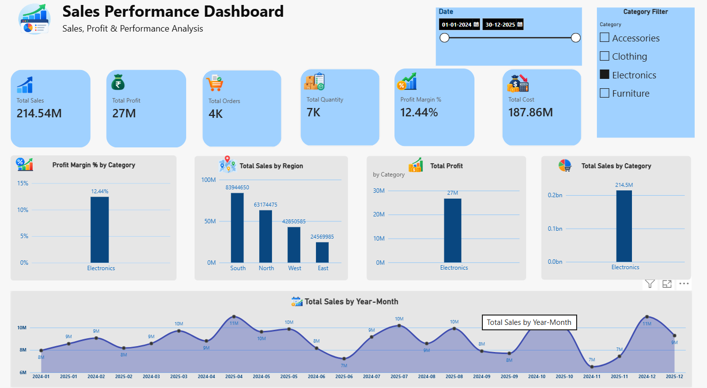
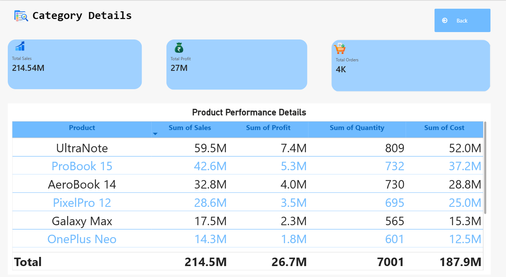

# E-Commerce Sales Analytics Dashboard | Power BI

An interactive **E-Commerce Sales Analytics Dashboard** built using Microsoft Power BI to analyze sales, profit, orders, quantity, cost, and profit margin across different categories, regions, and time periods.

## Project Overview

This project transforms raw e-commerce sales data into an interactive business intelligence dashboard for understanding overall sales performance and product-level performance.

## Key Features

* KPI analysis for Total Sales, Total Profit, Total Orders, Total Quantity, Profit Margin, and Total Cost
* Category-wise sales and profit analysis
* Region-wise sales analysis
* Year-month sales trend analysis
* Interactive Date and Category slicers
* Product-level Drill-through analysis
* Dedicated Category Details page with product performance table

## Tools & Technologies

* Microsoft Power BI
* DAX
* Power Query
* Data Modeling
* Excel / CSV

## Dashboard Preview

### Sales Performance Dashboard

### Category Details

## Data Model

The report uses separate **Customer, Product, Sales, and Date** tables connected through relationships for interactive analysis.

## Skills Demonstrated

Data Cleaning • Data Transformation • Data Modeling • DAX Measures • Data Visualization • KPI Reporting • Interactive Dashboards • Drill-through Analysis

## Project Objective

To convert raw e-commerce data into a clear and interactive dashboard that helps users explore sales performance and product-level insights efficiently.
